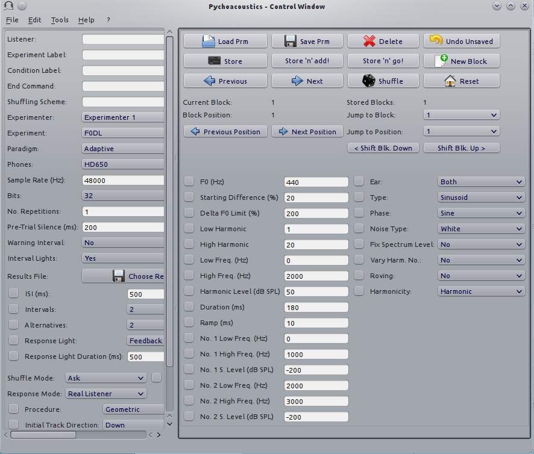

****************************
What is ``pychoacoustics``?
****************************

``pychoacoustics`` is a software for programming and running experiments 
in auditory psychophysics (psychoacoustics). The software contains a set 
of predefined experiments that can be immediately run after installation. 
Importantly, ``pychoacoustics`` is designed to be extensible so that users 
can add new custom experiments with relative ease. Custom experiments are 
written in Python, a programming language renowned for its clarity and 
ease of use. The application is divided in two graphical windows 
a) the “response box”, shown in Figure :ref:`fig-response_box`, with 
which listeners interact during the experiment, and b) the control window, 
shown in Figure :ref:`fig-control_window`, that contains a series of 
widgets (choosers, text fields and buttons) that are used by the experimenter 
to set all of the relevant experimental parameters which can also be stored 
and later reloaded into the application. 

.. _fig-response_box:

.. figure:: Figures/response_box.png
   :scale: 50%
   :alt: The pychoacoustics response box

   The pychoacoustics response box

.. _fig-control_window:

   The pychoacoustics control window

Some of the main features of pychoacoustics are that:

- pychoacoustics lets you create complex auditory experiments with relative ease
- experimental variables can be easily manipulated, stored, and retrieved using a graphical user interface
- pychoacoustics takes care of stimulus presentation, including setting up interval lights and response buttons
- pychoacoustics takes care of collecting responses, computing summary measures such as threshold estimates, and *d'*, and storing them as CSV files so that they can be readily visualized and processed using statistics programs (R, SPSS, etc...), or spreadsheet applications (Excel, Libreoffice Calc, etc...)
- pychoacoustics supports the most commonly used stimulus presentation procedures, such as the transformed up-down, same-different, and ABX procedures. It also supports less known and cutting-edge procedures such as the update maximum likelihood and the PSI+ and PSI-marginal procedures
- for many procedures pychoacoustics provides graphical summaries of the results 
- pychoacoustics stores all important information, including names and values of experimental parameters, timestamps, participant identification codes (if provided), version of the software used to run the experiment, etc..., so that no important information is accidentally lost
- pychoacoustics allows you to present standardized written instructions to participants at the beginning of the experiment, or the beginning of specific blocks of trials. Participants can also get an idea of how much of an experiment they have completed through optional progress bars.
- pychoacoustics includes `sndlib.py` a library that lets you easily generate experimental stimuli commonly used in psychoacoustics experiments (pure tones, complex tones, noise, etc...)

  
I started writing ``pychoacoustics`` for fun and for the sake of
learning around 2008 while doing my PhD under the supervision of Professor Chris Plack at
Lancaster University. At that time we were using in the lab a MATLAB
program called the “Earlab” written by Professor Plack.
``pychoacoustics`` has been greatly influenced and inspired by the
“Earlab”. For this reason, as well as for the time he dedicated to teach
me audio programming, I am greatly indebted to Professor Plack.    
