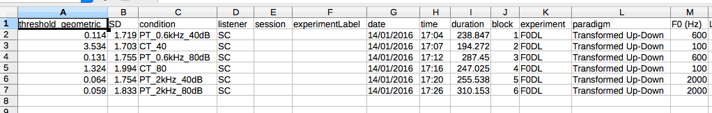

.. _sec-results_files:

Result Files
*************

``pychoacoustics`` outputs several types of
result files, these are listed in Table :ref:`tab-res_files`

.. _tab-res_files:

.. table:: List of result files produced by ``pychoacoustics``

  ======================== ============================= ========== ======================
  Type                     Example                       Formatting Suffix
  ======================== ============================= ========== ======================
  Block summary            ``myres.txt``                 Plain      ".txt"
  Trial summary            ``myres_trial.txt``           Plain      "_trial.txt"
  Session Summary          ``myres_sess.txt``	         Plain      "_sess.txt"
  Tabular Block Summary    ``myres_table.csv``           Tabular    "_table.csv"
  Tabular Trial Summary    ``myres_table_trial.csv``     Tabular    "_table_trial.csv"
  Tabular Session Summary  ``myres_table_sess.csv``      Tabular    "_table_sess.csv"
  ======================== ============================= ========== ======================
  
there are both "plain text" and "tabular" versions of result files. The plain text version stores along with the results each parameter that was used during the experiment. The tabular result files
on the other hand store a smaller number of parameters, although additional parameters can be stored if the
experimenter wishes to do so (see :ref:`sec-tabular-results-files`). An important advantage of
tabular result files is that they are easy to import in other software (e.g. R, Libreoffice Calc) for data analysis.
   
The plain-text “block-summary” and tabular "block-summary" result files contain summaries 
for each experimental block that was run. The plain-text “trial-summary” and tabular "trial-summary" result 
files instead contain information on each single
trial. The “block-summary” result files (either in plain or tabular format) can be usually processed to
obtain “session-summary” files.
The "session-summary" files contain summaries for an entire 
experimental session. In these files the results are averaged across 
different blocks that have exactly the same stored parameters.

In order to obtain the session-summary
files you need to use the appropriate functions that can be accessed
from the ``pychoacoustics`` “File” menu. Alternatively, you can check the “Proc. Res.” 
and “Proc. Res. Table” checkboxes in the control window (see :ref:`sec-gui_left_panel`)
to let ``pychoacoustics`` automatically process these files at the end of an
experimental session. If processing the result files manually, choose
“Process Results (Plain Text)” from the “File” menu, to convert a block-summary file
into a session-summary file. Choose “Process Results Table” to
convert a tabular block-summary file into a tabular session
summary file. You can choose to
process all blocks present in the file (default action), the last
:math:`n` blocks (of each condition), or a range of blocks (for each
condition). Once you have selected the file to process and specified the
blocks to process you can click “Run!” to perform the processing.
The functions that process the block-summary files also allow you to plot the
results. Please, note that both the ability to process the block-summary files
and plot the results are not available for all paradigms.
A list of the result files processing and plotting facilities available
for each paradigm is given in Table :ref:`tab-proc_res`

.. _tab-proc_res:

.. table:: Process results and plot facilities for various paradigms

  ==================================================  ========== ================== =======
  Procedure                                           Proc. Res. Proc. Res. Table   Plot
  ==================================================  ========== ================== =======
  Constant 1-Interval 2-Alternatives                  Yes        Yes                Yes
  Constant 1-Pair Same/Different                      Yes        Yes                Yes
  Constant m-Intervals n-Alternatives                 Yes        Yes                Yes
  Multiple Constants ABX                              Yes        Yes                Yes
  Multiple Constants 1-Interval 2-Alternatives        Yes        Yes                Yes
  Multiple Constants 1-Pair Same/Different            Yes        Yes                Yes
  Multiple Constants m-Intervals n-Alternatives       Yes        Yes                Yes
  Multiple Constants Odd One Out                      No         Yes                No
  Multiple Constants Sound Comparison                 No         No                 No	   
  PEST                                                Yes        Yes                Yes
  PSI                                                 No         No                 No
  Transformed Up-Down                                 Yes        Yes                Yes
  Transformed Up-Down Interleaved                     Yes        Yes                Yes
  UML                                                 No         No                 No
  Weighted Up-Down                                    Yes        Yes                Yes
  Weighted Up-Down Interleaved                        Yes        Yes                Yes
  ==================================================  ========== ================== =======

.. _sec-tabular-results-files:

Tabular Results Files
=====================

The tabular results files are comma separated value (CSV) text files
that can be opened in a text file editor or a spreadsheet application.
The separator used by default is the semicolon “;”, but another
separator can be specified in the ``pychoacoustics`` preferences window.
When processing block-summary table files, make sure that the csv
separator in the “Process Results Table” window matches the separator
used in the file.

The tabular result files contain three sets of columns:

- paradigm-specific columns (e.g. threshold estimate, for the transformed
  up-down procedure, or *d'* for the constant 1-pair same/different procedure).
  The columns that are specific to each paradigm will be described in
  Section :ref:`sec-result_files_by_paradigm`
- fixed columns that are common to all paradigms (e.g. date and time
  at which a block of trials started). Among these columns there is a
  "condition" column, where the "condition label" is written
  (see :ref:`sec-gui_left_panel`). It is a good practice to assign 
  a condition label as it makes it easy to sort the results as a function of the 
  experimental condition.
- additional user-defined columns specific to each experiment

The way in which these additional user-defined columns are stored is as follows:
Several text fields and choosers in ``pychoacoustics`` have what we will call
``inSummary`` check boxes. Some of these are shown marked by ellipses 
in Figure :ref:`fig-inSummaryCheckBoxes`.

.. _fig-inSummaryCheckBoxes:

.. figure:: Figures/inSummaryCheckBoxes.png
   :scale: 75%
   :alt: ``inSummary`` check boxes

   ``inSummary`` check boxes

In the example shown in Figure :ref:`fig-inSummaryCheckBoxes` the frequency,
level and ear parameters will be stored, each in a separate column, in
the tabular block-summary file, while the parameters
corresponding to the unchecked boxes (duration, ramps and type) will be
not. This is useful if you are running an experiment in which you are
systematically varying only a few parameters across different blocks,
and want to keep track of only those parameters. The ``inSummary`` check
boxes also provide visual landmarks for quickly spotting the widgets
with your parameters of interest in ``pychoacoustics``.

Notice that the “Process Results Table” function, as mentioned in the
previous section, will average the results for blocks with the same
parameters stored in the tabular block-summary file. This
means that if you are varying a certain parameter (e.g., level) across
blocks, but you don’t check the corresponding ``inSummary`` check box
(for each block), the value of the parameter will not be stored in the
tabular block-summary file, and as a consequence the “Process
Results Table” function will not be able to sort the blocks according to
the “level” parameter, and will average the results across all blocks.
Not all is lost because the “level” parameter will be nonetheless
stored in the “block-summary” plain-text file, but you will need more work before
you can process your results with a statistical software package.

Figure :ref:`fig-up_down_res_tab` shows a table block-summary result
file from a transformed up-down procedure opened in Libreoffice Calc.

.. _fig-up_down_res_tab:

   Transformed up-down table block-summary result file

the first two columns ("threshold geometric", and "SD") are specific
to the transformed up-down procedure. The set of fixed columns
that are common to all paradigms is described below:

- **condition** the the "condition label" for the block (see :ref:`sec-gui_left_panel`)
- **listener** the listener identifier (see :ref:`sec-gui_left_panel`)
- **session** the session identifier (see :ref:`sec-gui_left_panel`)
- **experimentLabel** the label assigned to the current experiment
  (see :ref:`sec-gui_left_panel`)
- **date** the date (DD/MM/YYYY) at which the block started
- **time** the time at which the block started
- **duration** how long it took for the listener to complete the
  block, in seconds
- **block** the block presentation position
- **experiment** the name of the experiment that was run
- **paradigm** the paradigm with which the experiment was run

The tabular trial-summary result files contain information on each single trial. For example 
for the transformed up-down paradigm they record the response (1 for correct, 0 for incorrect), and
the value of the adaptive difference (the variable that is being varied adaptively to find its threshold).
This trial by trial information can be used for various purposes, for example, it can be used to fit
psychometric functions from the results of adaptive procedures.

The tabular result files contain four sets of columns:

- paradigm-specific columns (e.g. threshold estimate, for the transformed
  up-down procedure, or *d'* for the constant 1-pair same/different procedure).
  The columns that are specific to each paradigm will be described in
  Section :ref:`sec-result_files_by_paradigm`
- experiment-specific columns, for example a frequency discrimination task with
  roving frequency of the standard may store the value of the standard frequency on each trial  
- fixed columns that are common to all paradigms (e.g. date and time
  at which a block of trials started). Among these columns there is a
  "condition" column, where the "condition label" is written
  (see :ref:`sec-gui_left_panel`). It is a good practice to assign 
  a condition label as it makes it easy to sort the results as a function of the 
  experimental condition.
- additional user-defined columns specific to each experiment
    
.. todo::
   
   For the experiment-specific column in tabular trial-summary files, make reference to prm['additional_parameters_to_write'] when it will be explained in the writing your own experiments section

.. _sec-plain-text-results-files:

Plain-Text Result Files
=======================

The "block-summary" result and the "trial-summary" result files
have a header for each experimental block. The start of the header
is marked by a line of 54 asterixes, an example is given below:

::

   *******************************************************
   pychoacoustics version: 0.2.73; build date: 01-Mar-2014 09:45
   Experiment version: pychoacoustics.default_experiments.audiogram 0.2.73 01-Mar-2014 09:45
   Block Number: 1
   Block Position: 1
   Start: 01/03/2014 14:07

the header gives info on the software version, the experiment
version (if available), the block storage point (Block Number), 
the block presentation position (Block Position), and has a 
timestamp marking the date and time at which the block was started.

After the header, there is a "parameters section" listing the 
experimental parameters. The beginning and the end of this section
are marked by a line of 54 plus signs, a snippet of the parameters
section is shown below:

::

   +++++++++++++++++++++++++++++++++++++++++++++++++++++++

   Experiment Label: 
   Session Label: 
   Condition Label: 
   Experiment:    Audiogram
   Listener: L3     
   [ ... ]
   Response Light Duration (ms): 500
   ISI:           500

   Ear: Right
   Signal Type: Sinusoid
   Frequency (Hz):  1000
   Level (dB SPL):  50
   Duration (ms):  180
   Ramps (ms):  10
   +++++++++++++++++++++++++++++++++++++++++++++++++++++++

After the parameters section there is a "results section". 
The specific structure of this section
depends on the paradigm (e.g. transformed up-down, or constant
1-interval 2-alternatives) used.
The specific structure of the result section for each type of
procedure will be illustrated in Section :ref:`sec-result_files_by_paradigm`.
The results section of a block-summary result file will contain
summary statistics for a whole block of trials, while the results
section of a trial-summary result file will contain trial-by-trial information.
Besides having paradigm-specific information, "trial-summary" result files may also have
experiment specific information. For example for a frequency discrimination task with
roving frequency of the standard, the trial-summary result file may store the value of the standard frequency on each trial.
For both "block-summary", and "trial-summary" result files the result section ends invariably with a timestamp marking the
date and time at which the
experimental block was completed, and a further line indicating
how much time the listener took to complete the block of trials.

.. todo::
   
   For the experiment-specific column in plain-text trial-summary result files, make reference to prm['additional_parameters_to_write'] when it will be explained in the writing your own experiments section

The "session-summary" result files have a section listing the
parameters used for each experimental condition. After this
section, a summary statistic for each block of the given experimental
condition is presented, followed by a summary statistic for all the blocks.
The specific structure of this result section for each type of
procedure will be illustrated in Section :ref:`sec-result_files_by_paradigm`.

.. _sec-result_files_by_paradigm:

Result Files by Paradigm
========================

In this section the fields of result files that are specific to each
paradigm will be described.

Transformed Up-Down and Weighted Up-Down
----------------------------------------

Tabular Block-Summary Result Files (Transformed Up-Down and Weighted Up-Down)
^^^^^^^^^^^^^^^^^^^^^^^^^^^^^^^^^^^^^^^^^^^^^^^^^^^^^^^^^^^^^^^^^^^^^^^^^^^^^

The transformed up-down and weighted up-down tabular block-summary result files have two
paradigm-specific columns:

- **threshold_arithmetic** or **threshold_geometric** the estimate of the threshold derived by averaging
  the final turnpoints of the adaptive track. Whether the column is named "threshold_arithmetic", or
  "threshold_geometric" depends on whether the adaptive track followed a geometric, or an arithmetic
  procedure. For "threshold_arithmetic" the threshold estimate is the arithmetic mean
  of the turnpoints, for "threshold_geometric" the threshold estimate is the geometric mean of
  the turnpoints.
- **SD** the standard deviation of the final turnpoints of the adaptive track. If the procedure
  is geometric the geometric standard deviation is calculated, otherwise the arithmetic standard deviation
  is calculated.

Tabular Trial-Summary Result Files (Transformed Up-Down and Weighted Up-Down)
^^^^^^^^^^^^^^^^^^^^^^^^^^^^^^^^^^^^^^^^^^^^^^^^^^^^^^^^^^^^^^^^^^^^^^^^^^^^^

The transformed up-down and weighted up-down tabular trial-summary result files have two
paradigm-specific columns:

- **adaptive_difference** the value of the adaptive difference, that is the variable that is being varied adaptively to find its threshold
- **response** 1 if the response was correct, 0 otherwise
 

Tabular Session-Summary Result Files (Transformed Up-Down and Weighted Up-Down)
^^^^^^^^^^^^^^^^^^^^^^^^^^^^^^^^^^^^^^^^^^^^^^^^^^^^^^^^^^^^^^^^^^^^^^^^^^^^^^^

The transformed up-down and weighted up-down tabular session-summary result files have two
paradigm-specific columns:

- **threshold_arithmetic** or **threshold_geometric** the arithmetic, or geometric average
  of the threshold estimates obtained in each block
- **SE** the arithmetic or geometric standard error of the  threshold estimates obtained in each block
    

Plain-Text Block-Summary Result Files (Transformed Up-Down and Weighted Up-Down)
^^^^^^^^^^^^^^^^^^^^^^^^^^^^^^^^^^^^^^^^^^^^^^^^^^^^^^^^^^^^^^^^^^^^^^^^^^^^^^^^

The results section of a transformed up-down procedure are shown below
(weighted up-down result files have the same structure):

::

   42.00 62.00 58.00 66.00 | 60.00 64.00 58.00 62.00 54.00 56.00 50.00 52.00 | 

   turnpointMean = 57.00, s.d. =  4.90 
   B1 = 30, B2 = 22

the first line lists the turnpoints; the first ``|`` sign separates 
the initial turnpoints, which are not included in the threshold estimate, 
from the final turnpoints. The second line shows the threshold estimate 
(``turnpointMean``) which is obtained by averaging the final turnpoints,
and the standard deviation of the turnpoints.
The final line lists the number of times each button was pressed by the listener.
In the above case the listener pressed button one 30 times and button two 22 times.
This may be useful to detect any biases in the choice of interval. The results above were collected using
an arithmetic procedure. When the results are obtained with a geometric procedure
the second line of the results section labels the threshold estimate as 
``geometric turnpointMean``, as shown in the example below:

::

   0.08  5.00  1.25 80.00 | 10.00 40.00 10.00 200.00 25.00 200.00  6.25 25.00 | 

   geometric turnpointMean = 29.82, s.d. =  3.75 
   B1 = 22, B2 = 40

and the threshold and standard deviation values are computed as geometric mean, and geometric standard deviation, respectively.

Plain-Text Trial-Summary Result Files (Transformed Up-Down and Weighted Up-Down)
^^^^^^^^^^^^^^^^^^^^^^^^^^^^^^^^^^^^^^^^^^^^^^^^^^^^^^^^^^^^^^^^^^^^^^^^^^^^^^^^

A snippet from a transformed up-down trial-summary result file is shown
below:

::

   50.0; 1; 
   50.0; 1; 
   46.0; 1; 
   46.0; 1; 
   42.0; 1; 
   42.0; 0; 
   46.0; 0; 
   50.0; 1; 

each row represents a trial, the first colum shows the value of the
adaptive difference for that trial (e.g. the level of the signal in
a signal detection task), while the second column indicates whether
the response was correct (``1``), or incorrect (``0``). Note that 
depending on the experiment, additional variables may be stored in
a ``trial-summary`` result file. For example, in the ``F0DL`` experiment, which
has an option to use either a fixed, or a roving F0, the F0 for the
trial is listed in the third column of the ``trial-summary`` result file, as shown
below:

::

   20.0; 1; 408.58891957189206 ;
   20.0; 1; 409.72312872085564 ;
   5.0; 1; 474.15423804320403 ;
   5.0; 1; 404.43567907073964 ;
   1.25; 1; 456.6493420827598 ;
   1.25; 1; 406.34270314673716 ;

Plain-Text Session-Summary Files (Transformed Up-Down and Weighted Up-Down)
^^^^^^^^^^^^^^^^^^^^^^^^^^^^^^^^^^^^^^^^^^^^^^^^^^^^^^^^^^^^^^^^^^^^^^^^^^^

The result section of a session-summary result file for a transformed up-down procedure is shown
below:

::

   57.00
   44.00

   Mean = 50.50 
   SE =  6.50 

the session included two blocks of trials, and the first two lines
list the threshold estimate for each of these blocks. The following
lines present the mean and the standard error of these threshold
estimates. If the procedure is arithmetic, the mean and the standard error
are calculated as the arithmetic meand and the arithmetic standard error.
If the procedure is geometric, the mean and the standard error
are calculated as the geometric meand and the geometric standard error.

Transformed Up-Down and Weighted Up-Down Interleaved Result Files
------------------------------------------------------------------

Tabular Block-Summary Result Files (Transformed Up-Down and Weighted Up-Down Interleaved)
^^^^^^^^^^^^^^^^^^^^^^^^^^^^^^^^^^^^^^^^^^^^^^^^^^^^^^^^^^^^^^^^^^^^^^^^^^^^^^^^^^^^^^^^^

For each adaptive track, the transformed up-down and weighted up-down interleaved tabular block-summary result files have two
paradigm-specific columns:

- **threshold_arithmetic_trackX** or **threshold_geometric_trackX** the estimate of the threshold derived by averaging
  the final turnpoints of the adaptive track number *X*. Whether the column is named "threshold_arithmetic", or
  "threshold_geometric" depends on whether the adaptive track followed a geometric, or an arithmetic
  procedure. For "threshold_arithmetic" the threshold estimate is the arithmetic mean
  of the turnpoints, for "threshold_geometric" the threshold estimate is the geometric mean of
  the turnpoints.
- **SD_trackX** the standard deviation of the final turnpoints of the
  adaptive track number *X*. If the procedure
  is geometric the geometric standard deviation is calculated, otherwise the arithmetic standard deviation
  is calculated.

Tabular Trial-Summary Result Files (Transformed Up-Down and Weighted Up-Down Interleaved)
^^^^^^^^^^^^^^^^^^^^^^^^^^^^^^^^^^^^^^^^^^^^^^^^^^^^^^^^^^^^^^^^^^^^^^^^^^^^^^^^^^^^^^^^^

Not currently implemented.

Tabular Session-Summary Result Files (Transformed Up-Down and Weighted Up-Down Interleaved)
^^^^^^^^^^^^^^^^^^^^^^^^^^^^^^^^^^^^^^^^^^^^^^^^^^^^^^^^^^^^^^^^^^^^^^^^^^^^^^^^^^^^^^^^^^^

For each adaptive track, the transformed up-down and weighted up-down
interleaved tabular session-summary result files have two
paradigm-specific columns:

- **threshold_arithmetic_trackX** or **threshold_geometric_trackX** the arithmetic, or geometric average
  of the threshold estimates obtained in each block for the adaptive
  track number *X*
- **SE_trackX** the arithmetic or geometric standard error of the
  threshold estimates obtained in each block for the track number *X*

Plain-Text Block-Summary Result Files (Transformed Up-Down and Weighted Up-Down Interleaved)
^^^^^^^^^^^^^^^^^^^^^^^^^^^^^^^^^^^^^^^^^^^^^^^^^^^^^^^^^^^^^^^^^^^^^^^^^^^^^^^^^^^^^^^^^^^^

The result section of a plain-text block-summary file with a
transformed up-down interleaved paradigm is shown below:

::
   
   TRACK 1:
   -212.00 -208.00 -212.00 -200.00 | -204.00 -200.00 -204.00 -202.00 -204.00 -202.00 -208.00 -206.00 -208.00 -202.00 -206.00 -202.00 -208.00 -206.00 -208.00 -204.00 -208.00 -204.00 -210.00 -206.00 -210.00 -204.00 -206.00 -204.00 | 

   turnpointMean = -205.25, s.d. =  2.69 
   B1 = 44, B2 = 47

   TRACK 2:
   -208.00 -200.00 -208.00 -204.00 | -214.00 -212.00 -228.00 -224.00 -226.00 -224.00 -232.00 -230.00 -232.00 -230.00 -238.00 -232.00 | 

   turnpointMean = -226.83, s.d. =  7.55 
   B1 = 29, B2 = 42

for each track, after the track label ("TRACK 1", "TRACK 2", etc...), the first line lists the turnpoints; the first ``|`` sign separates 
the initial turnpoints, which are not included in the threshold estimate, 
from the final turnpoints. The second line after the track label shows the threshold estimate 
(``turnpointMean``) which is obtained by averaging the final turnpoints,
and the standard deviation of the turnpoints.
The final line lists the number of times each button was pressed by
the listener. The results above were collected using
an arithmetic procedure. When the results are obtained with a geometric procedure
the second line of the results section labels the threshold estimate as 
``geometric turnpointMean``, and the threshold and standard deviation
values are computed as geometric mean, and geometric standard deviation, respectively.

Plain-Text Trial-Summary Result Files (Transformed Up-Down and Weighted Up-Down Interleaved)
^^^^^^^^^^^^^^^^^^^^^^^^^^^^^^^^^^^^^^^^^^^^^^^^^^^^^^^^^^^^^^^^^^^^^^^^^^^^^^^^^^^^^^^^^^^^

A snippet from the he results section of a plain-text trial-summary file for a
transformed up-down interleaved paradigm is shown below:

::
   
   -200.0; TRACK 1; 1; 
   -200.0; TRACK 2; 1; 
   -200.0; TRACK 1; 1; 
   -200.0; TRACK 2; 1;

for each trial, the first column shows the value of the adaptive difference (e.g. the level of the signal in
a signal detection task), the second column shows the track number,
and the third column indicates whether the response was correct (``1``), or incorrect (``0``)

Plain-Text Session-Summary Files (Transformed Up-Down and Weighted Up-Down Interleaved)
^^^^^^^^^^^^^^^^^^^^^^^^^^^^^^^^^^^^^^^^^^^^^^^^^^^^^^^^^^^^^^^^^^^^^^^^^^^^^^^^^^^^^^^

The results section of a plain-text session-summary file for a
transformed up-down interleaved paradigm is shown below:

::
   
   ----------
   TRACK 1: 
   -205.25
   -228.33

   Mean = -216.79 
   SE = 11.54 

   ----------
   TRACK 2: 
   -226.83
   -214.14

   Mean = -220.49 
   SE =  6.35

for each track, first a list of the threshold estimates obtained in
each block is printed. Then the geometric or arithmetic (depending on
the procedure) mean and standard deviation are shown.

UML and PSI Result Files
------------------------

Tabular Block-Summary Result Files (UML and PSI)
^^^^^^^^^^^^^^^^^^^^^^^^^^^^^^^^^^^^^^^^^^^^^^^^

The UML and PSI tabular block-summary result files have three
paradigm-specific columns:

- **threshold** the estimate of the threshold, or the midpoint of the psychometric function
- **slope** the estimate of the slope of the psychometric function
- **lapse** the estimate of the lapse rate, which determines the upper asymptote of the psychometric function

Tabular Trial-Summary Result Files (UML and PSI)
^^^^^^^^^^^^^^^^^^^^^^^^^^^^^^^^^^^^^^^^^^^^^^^^

The UML and PSI tabular block-summary result files have two
paradigm-specific columns:

- **adaptive_difference** the value at each trial of the parameter that is 
  adaptively varied to find the psychometric function
- **response** the response of the listener, 1 if s/he chose the correct
  interval, 0 otherwise

Tabular Session-Summary Result Files (UML and PSI)
^^^^^^^^^^^^^^^^^^^^^^^^^^^^^^^^^^^^^^^^^^^^^^^^^^

Not currently implemented. Probably this will be never implemented
because it makes more sense to obtain session estimates by fitting psychometric functions to the
responses across all the session than to average the estimates from
the tabular block-summary result files.

Plain-Text Block-Summary Result Files (UML and PSI)
^^^^^^^^^^^^^^^^^^^^^^^^^^^^^^^^^^^^^^^^^^^^^^^^^^^

The results section of a UML procedure is shown below
(the structure for the PSI procedure is the same):

::
     
   Midpoint = 0.046 
   Slope = 1.299 
   Lapse = 0.061 

   B1 = 51, B2 = 49

the first line shows the estimated midpoint of the psychometric function (the threshold),
the second line shows the estimated slope of the psychometric function, and the third line
shows the estimated lapse rate which determines the upper asymptote of the psychometric function.

Plain-Text Trial-Summary Result Files (UML and PSI)
^^^^^^^^^^^^^^^^^^^^^^^^^^^^^^^^^^^^^^^^^^^^^^^^^^^

The result section of the UML and PSI tabular trial-summary files has two paradigm-specific columns. The first column
shows the value of the adaptive difference (the parameter that is 
adaptively varied to find the psychometric function) for each trial. The second column
shows the response (1 for correct, 0 otherwise) given by the listener
on each trial.

Plain-Text Session-Summary Result Files (UML and PSI)
^^^^^^^^^^^^^^^^^^^^^^^^^^^^^^^^^^^^^^^^^^^^^^^^^^^^^

Not currently implemented. Probably this will be never implemented
because it makes more sense to obtain session estimates by fitting psychometric functions to the
responses across all the session than to average the estimates from
the plain-text block-summary result files.

PEST Result Files
-----------------

Tabular Block-Summary Result Files (PEST)
^^^^^^^^^^^^^^^^^^^^^^^^^^^^^^^^^^^^^^^^^

The PEST tabular block-summary result files have a single paradigm
specific column:

- **threshold_arithmetic** or **threshold_geometric** the threshold estimate. Whether the column is labelled "threshold_arithmetic", or "threshold_geometric" depends on whether an arithmetic, or a geometric procedure was used to vary the adaptive difference (the variable that is being varied adaptively to find its threshold).

Tabular Trial-Summary Result Files (PEST)
^^^^^^^^^^^^^^^^^^^^^^^^^^^^^^^^^^^^^^^^^

Not currently implemented.

Tabular Session-Summary Result Files (PEST)
^^^^^^^^^^^^^^^^^^^^^^^^^^^^^^^^^^^^^^^^^^^

The PEST tabular session-summary result files have two paradigm
specific columns:

- **threshold_arithmetic** or **threshold_geometric** the threshold estimated by averaging across trial blocks. Whether the column is labelled "threshold_arithmetic", or "threshold_geometric" depends on whether an arithmetic, or a geometric procedure was used to vary the adaptive difference (the variable that is being varied adaptively to find its threshold). For "threshold_arithmetic" the threshold estimate is obtained by the arithmetic mean of the threshold estimates in each block. For "threshold_geometric" the threshold estimate is obtained by the geometric mean of the threshold estimates in each block. 
- **SE** the standard error of the mean threshold obtained by averaging across blocks. For "threshold_arithmetic" the standard error is obtained by the arithmetic standard error of the threshold estimates in each block. For "threshold_geometric" the standard error is obtained by the geometric standard error of the threshold estimates in each block. 

Plain-Text Block-Summary Result Files (PEST)
^^^^^^^^^^^^^^^^^^^^^^^^^^^^^^^^^^^^^^^^^^^^

The result section of a plain-text block-summary result file obtained with the PEST paradigm is shown below:

::

   Threshold =  0.62 
   B1 = 179, B2 = 160

the first line shows the threshold estimate. The second line shows how many times the listener pressed each button. This may be useful to detect any biases in the choice of interval.

Plain-Text Trial-Summary Result Files (PEST)
^^^^^^^^^^^^^^^^^^^^^^^^^^^^^^^^^^^^^^^^^^^^

A snippet from a plain-text trial-summary result file obtained
with the PEST paradigm is shown below:

::

   50.0; 1; 
   50.0; 1; 
   50.0; 1; 
   50.0; 1; 
   50.0; 1; 
   50.0; 1; 
   50.0; 1; 
   45.0; 1; 
   40.0; 1; 
   30.0; 1; 
   30.0; 1; 
   30.0; 1;

the first column shows the value of the adaptive difference that was tested in
each trial. The second column indicates whether the listener's response was correct
or not (1 for correct, 0 otherwise).
   
Plain-Text Session-Summary Files (PEST)
^^^^^^^^^^^^^^^^^^^^^^^^^^^^^^^^^^^^^^^

The result section of a plain-text session-summary result file obtained with the PEST paradigm is shown below:

::

    0.62
    -0.62

    Mean =  0.00 
    SE =  0.62
   
the section starts with a listing of the threshold estimates obtained in each block.
After this listing the mean and standard error (arithmetic, or geometric, depending on the procedure used) of these threshold estimates are shown.

Constant m-Intervals n-Alternatives Result Files
------------------------------------------------

Tabular Block-Summary Result Files (Constant m-Intervals n-Alternatives)
^^^^^^^^^^^^^^^^^^^^^^^^^^^^^^^^^^^^^^^^^^^^^^^^^^^^^^^^^^^^^^^^^^^^^^^^

The constant m-intervals n-alternatives tabular block-summary result files have four
paradigm-specific columns:

- **dprime** the *d'* value
- **perc_corr** the percentage of correct response
- **n_corr** the number of correct responses
- **n_trials** the total number of trials

Tabular Trial-Summary Result Files (Constant m-Intervals n-Alternatives)
^^^^^^^^^^^^^^^^^^^^^^^^^^^^^^^^^^^^^^^^^^^^^^^^^^^^^^^^^^^^^^^^^^^^^^^^

Not currently available

Tabular Session-Summary Result Files (Constant m-Intervals n-Alternatives)
^^^^^^^^^^^^^^^^^^^^^^^^^^^^^^^^^^^^^^^^^^^^^^^^^^^^^^^^^^^^^^^^^^^^^^^^^^

The constant m-intervals n-alternatives tabular session-summary result files have four
paradigm-specific columns:

- **dprime** the *d'* value
- **perc_corr** the percentage of correct response
- **n_corr** the number of correct responses
- **n_trials** the total number of trials

Plain-Text Block-Summary Result Files (Constant m-Intervals n-Alternatives)
^^^^^^^^^^^^^^^^^^^^^^^^^^^^^^^^^^^^^^^^^^^^^^^^^^^^^^^^^^^^^^^^^^^^^^^^^^^

The result section of a plain-text block-summary result file obtained
with a constant m-intervals n-alternatives procedure is shown below:

::
   
   No. Correct = 37
   No. Total = 50
   Percent Correct =  0.74 
   d-prime = 0.910 

the first row shows the number of correct responses, the second row
shows the total number of trials, the third row shows the percentage
of correct responses, while the last row shows the *d'* value.
   
Plain-Text Trial-Summary Result Files (Constant m-Intervals n-Alternatives)
^^^^^^^^^^^^^^^^^^^^^^^^^^^^^^^^^^^^^^^^^^^^^^^^^^^^^^^^^^^^^^^^^^^^^^^^^^^

A snippet from a plain-text  trial-summary result file obtained
with a constant m-intervals n-alternatives procedure is shown below:

::
   
   1; 
   1; 
   0; 
   0; 
   1;

the first and only column shows the response of the listenr (1 for
correct, 0 otherwise).

Plain-Text Session-Summary Files (Constant m-Intervals n-Alternatives)
^^^^^^^^^^^^^^^^^^^^^^^^^^^^^^^^^^^^^^^^^^^^^^^^^^^^^^^^^^^^^^^^^^^^^^

::
   
   d-prime Block 1 = 0.910 
   d-prime Block 2 = 0.742 

   No. Correct = 72 
   No. Total = 100 
   Percent Correct = 72.00 
   d-prime = 0.824 

Multiple Constants m-Intervals n-Alternatives Result Files
----------------------------------------------------------

Tabular Block-Summary Result Files (Multiple Constants m-Intervals n-Alternatives)
^^^^^^^^^^^^^^^^^^^^^^^^^^^^^^^^^^^^^^^^^^^^^^^^^^^^^^^^^^^^^^^^^^^^^^^^^^^^^^^^^^

The multiple constants m-intervals n-alternatives tabular block-summary result files have four
paradigm-specific columns:

- **dprime_subcX** the *d'* value for sub-condition *X*
- **perc_corr_subcX** the percentage of correct response for sub-condition *X*
- **n_corr_subcX** the number of correct responses for sub-condition *X*
- **n_trials_subcX** the total number of trials for sub-condition *X*

Tabular Trial-Summary Result Files (Multiple Constants m-Intervals n-Alternatives)
^^^^^^^^^^^^^^^^^^^^^^^^^^^^^^^^^^^^^^^^^^^^^^^^^^^^^^^^^^^^^^^^^^^^^^^^^^^^^^^^^^

Not currently implemented.

Tabular Session-Summary Result Files (Multiple Constants m-Intervals n-Alternatives)
^^^^^^^^^^^^^^^^^^^^^^^^^^^^^^^^^^^^^^^^^^^^^^^^^^^^^^^^^^^^^^^^^^^^^^^^^^^^^^^^^^^^

The multiple constants m-intervals n-alternatives tabular
session-summary result files have the following
paradigm-specific columns:

- **dprime_ALL** the *d'* value across sub-conditions
- **perc_corr_ALL** the percentage of correct response across sub-conditions
- **n_corr_ALL** the number of correct responses across sub-conditions
- **n_trials_ALL** the total number of trials across sub-conditions

then for each sub-condition:

- **dprime_subcX** the *d'* value for sub-condition *X*
- **perc_corr_subcX** the percentage of correct response for sub-condition *X*
- **n_corr_subcX** the number of correct responses for sub-condition *X*
- **n_trials_subcX** the total number of trials for sub-condition *X*
  

Plain-Text Block-Summary Result Files (Multiple Constants m-Intervals n-Alternatives)
^^^^^^^^^^^^^^^^^^^^^^^^^^^^^^^^^^^^^^^^^^^^^^^^^^^^^^^^^^^^^^^^^^^^^^^^^^^^^^^^^^^^^

The result section of a plain-text block-summary result file obtained
with a multiple constants m-intervals n-alternatives procedure is shown below:

::
   
   CONDITION, 1; 1000.0
   No. Correct = 17
   No. Total = 25 
   Percent Correct = 68.00 
   d-prime = 0.661 

   CONDITION, 2; 2000.0
   No. Correct = 19
   No. Total = 25 
   Percent Correct = 76.00 
   d-prime = 0.999 

   CONDITION, ALL 
   No. Correct = 36
   No. Total = 50
   Percent Correct = 72.00 
   d-prime = 0.824

first, for each condition, after a line with the sub-condition number and
condition label, the number of correct responses, the number of total trials, the
percent of correct responses, and *d'* are show in successive lines. Then
the same information is shown for the data pooled across sub-conditions.

Plain-Text Trial-Summary Result Files (Multiple Constants m-Intervals n-Alternatives)
^^^^^^^^^^^^^^^^^^^^^^^^^^^^^^^^^^^^^^^^^^^^^^^^^^^^^^^^^^^^^^^^^^^^^^^^^^^^^^^^^^^^^

A snippet from a plain-text trial-summary result file obtained
with a multiple constants m-intervals n-alternatives procedure is
shown below:

::
   
   1000.0; 1; 
   1000.0; 1; 
   2000.0; 1; 
   1000.0; 0; 
   1000.0; 1; 
   2000.0; 1; 

the first column shows the sub-condition label for each trial, the second
column shows the response of the listener (1 for correct, 0
otherwise).

Plain-Text Session-Summary Files (Multiple Constants m-Intervals n-Alternatives)
^^^^^^^^^^^^^^^^^^^^^^^^^^^^^^^^^^^^^^^^^^^^^^^^^^^^^^^^^^^^^^^^^^^^^^^^^^^^^^^^

The result section of a plain-text session-summary result file obtained
with a multiple constants m-intervals n-alternatives procedure is shown below:

::
   
   CONDITION 1; 1000.0
   Percent Correct Block 1 = 68.00 
   Percent Correct Block 2 = 64.00 

   No. Correct = 33 
   No. Total = 50 
   Percent Correct = 66.00 
   d-prime = 0.583 

   CONDITION 2; 2000.0
   Percent Correct Block 1 = 76.00 
   Percent Correct Block 2 = 72.00 

   No. Correct = 37 
   No. Total = 50 
   Percent Correct = 74.00 
   d-prime = 0.910 

   CONDITION ALL
   Percent Correct Block 1 = 72.00 
   Percent Correct Block 2 = 68.00 

   No. Correct = 70 
   No. Total = 100 
   Percent Correct = 70.00 
   d-prime = 0.742

first, for each condition, a line with the sub-condition number and
sub-condition label is shown, followed by a list of the percentage of
correct responses for that condition in each block. After these lines
the number of correct responses, the number of total trials, the
percentage of correct responses, and *d'* are show in successive lines.

After these summaries for each sub-condition, the same summaries are shown
for the data pooled across sub-conditions ("CONDITION ALL").

Constant 1-Intervals 2-Alternatives Result Files
------------------------------------------------

Tabular Block-Summary Result Files (Constant 1-Intervals 2-Alternatives)
^^^^^^^^^^^^^^^^^^^^^^^^^^^^^^^^^^^^^^^^^^^^^^^^^^^^^^^^^^^^^^^^^^^^^^^^

The constant 1-interval 2-alternatives tabular block-summary result files have six
paradigm-specific columns:

- **dprime** the *d'* value
- **nTotal** the total number of trials 
- **nCorrectA** the number of correct responses for *A* (signal
  present) trials
- **nTotalA** the total number of *A* (signal present) trials
- **nCorrectB** the number of correct responses for *B* (signal
  absent) trials
- **nTotalB** the total number of *B* (signal absent) trials

Tabular Trial-Summary Result Files (Constant 1-Intervals 2-Alternatives)
^^^^^^^^^^^^^^^^^^^^^^^^^^^^^^^^^^^^^^^^^^^^^^^^^^^^^^^^^^^^^^^^^^^^^^^^

Not currently implemented.

Tabular Session-Summary Result Files (Constant 1-Intervals 2-Alternatives)
^^^^^^^^^^^^^^^^^^^^^^^^^^^^^^^^^^^^^^^^^^^^^^^^^^^^^^^^^^^^^^^^^^^^^^^^^^

The constant 1-interval 2-alternatives tabular session-summary result files have six
paradigm-specific columns:

- **dprime** the *d'* value
- **nTotal** the total number of trials 
- **nCorrectA** the number of correct responses for *A* (signal
  present) trials
- **nTotalA** the total number of *A* (signal
  present) trials
- **nCorrectB** the number of correct responses for *B* (signal
  absent) trials
- **nTotalB** the total number of *B* (signal
  absent) trials

Plain-Text Block-Summary Result Files (Constant 1-Intervals 2-Alternatives)
^^^^^^^^^^^^^^^^^^^^^^^^^^^^^^^^^^^^^^^^^^^^^^^^^^^^^^^^^^^^^^^^^^^^^^^^^^^

The result section of a plain-text block-summary result file obtained
with a constant 1-interval 2-alternatives procedure is
shown below:

::
   
   No. Correct = 16
   No. Total = 25
   Percent Correct = 64.00 
   d-prime = 0.785 

   No. Correct Condition Yes = 8
   No. Total Condition Yes = 11 
   Percent Correct Condition Yes = 72.73 
   No. Correct Condition No = 8
   No. Total Condition No = 14 
   Percent Correct Condition No = 57.14

the first part shows the number of correct responses, number of
total trials, the percentage of correct responses, and the d'
value. The second part shows the number of correct responses, the
number of total trials, and the percentage of correct responses
separately for signal present (in this case "Yes"), and signal absent
(in this case "No") trials. Please, note that "Yes", and "No" are the
names of the condition of the experiment that was ran. In other
experiments the names of the conditions will differ.

Plain-Text Trial-Summary Result Files (Constant 1-Intervals 2-Alternatives)
^^^^^^^^^^^^^^^^^^^^^^^^^^^^^^^^^^^^^^^^^^^^^^^^^^^^^^^^^^^^^^^^^^^^^^^^^^^

A snippet from a plain-text trial-summary result file obtained
with a constant 1-interval 2-alternatives procedure is
shown below:

::
   
   Yes; 1; 
   Yes; 1; 
   Yes; 0; 
   Yes; 1; 
   Yes; 1; 
   No; 0; 
   No; 0; 
   No; 0; 
   No; 0; 
   No; 1;

the first column shows the name of the condition (in this case "Yes"
for signal present, and "No" for signal absent). The second column
indicates  whether the response of the listener was correct or not (1 for correct, 0 otherwise).

Plain-Text Session-Summary Files (Constant 1-Intervals 2-Alternatives)
^^^^^^^^^^^^^^^^^^^^^^^^^^^^^^^^^^^^^^^^^^^^^^^^^^^^^^^^^^^^^^^^^^^^^^

The result section of a plain-text session-summary result file obtained
with a constant 1-interval 2-alternatives procedure is
shown below:

::
   
   d-prime Block 1 = 0.785
   d-prime Block 2 = 0.097

   No. Correct = 29 
   No. Total = 50 
   Percent Correct = 58.00 
   d-prime = 0.416 
   
   No. Correct A = 14 
   No. Total A = 23 
   Percent Correct A = 60.87 
   No. Correct B = 15 
   No. Total B = 27 
   Percent Correct B = 55.56

the section starts with a list of the *d'* values obtained on each block
of trials. The second paragraph shows the number of correct responses,
the total number of trials, the percentage of correct responses, and
the *d'* value. The last paragraph shows the number of correct
responses, the total number of trials, and the percentage of correct
responses separately for "A" (signal present), and "B" (signal absent) trials.

Multiple Constants 1-Intervals 2-Alternatives Result Files
----------------------------------------------------------

Tabular Block-Summary Result Files (Multiple Constants 1-Intervals 2-Alternatives)
^^^^^^^^^^^^^^^^^^^^^^^^^^^^^^^^^^^^^^^^^^^^^^^^^^^^^^^^^^^^^^^^^^^^^^^^^^^^^^^^^^

The multiple constants 1-interval 2-alternatives tabular block-summary
result files have the following paradigm-specific columns:

- **dprime_ALL** the *d'* value across all sub-conditions
- **nTotal_ALL** the total number of trials across all sub-conditions
- **nCorrectA_ALL** the number of correct responses for *A* (signal
  present) trials across all sub-conditions
- **nTotalA_ALL** the total number of *A* (signal present) trials across all sub-conditions
- **nCorrectB_ALL** the number of correct responses for *B* (signal
  absent) trials across all sub-conditions
- **nTotalB_ALL** the total number of *B* (signal absent) trials
  across all sub-conditions

then for each sub-condition:

- **dprime_subcX** the *d'* value for sub-condition *X*
- **nTotal_subcX** the total number of trials for sub-condition *X*
- **nCorrectA_subcX** the number of correct responses for *A* (signal
  present) trials for sub-condition *X*
- **nTotalA_subcX** the total number of *A* (signal present) trials for sub-condition *X*
- **nCorrectB_subcX** the number of correct responses for *B* (signal
  absent) trials for sub-condition *X*
- **nTotalB_subcX** the total number of *B* (signal absent) trials for sub-condition *X*

Tabular Trial-Summary Result Files (Multiple Constants 1-Intervals 2-Alternatives)
^^^^^^^^^^^^^^^^^^^^^^^^^^^^^^^^^^^^^^^^^^^^^^^^^^^^^^^^^^^^^^^^^^^^^^^^^^^^^^^^^^

Not currently implemented.

Tabular Session-Summary Result Files (Multiple Constants 1-Intervals 2-Alternatives)
^^^^^^^^^^^^^^^^^^^^^^^^^^^^^^^^^^^^^^^^^^^^^^^^^^^^^^^^^^^^^^^^^^^^^^^^^^^^^^^^^^^^

The multiple constants 1-interval 2-alternatives tabular session-summary
result files have the following paradigm-specific columns:

- **dprime_ALL** the *d'* value across all sub-conditions
- **nTotal_ALL** the total number of trials across all sub-conditions
- **nCorrectA_ALL** the number of correct responses for *A* (signal
  present) trials across all sub-conditions
- **nTotalA_ALL** the total number of *A* (signal present) trials across all sub-conditions
- **nCorrectB_ALL** the number of correct responses for *B* (signal
  absent) trials across all sub-conditions
- **nTotalB_ALL** the total number of *B* (signal absent) trials
  across all sub-conditions

then for each sub-condition:

- **dprime_subcX** the *d'* value for sub-condition *X*
- **nTotal_subcX** the total number of trials for sub-condition *X*
- **nCorrectA_subcX** the number of correct responses for *A* (signal
  present) trials for sub-condition *X*
- **nTotalA_subcX** the total number of *A* (signal present) trials for sub-condition *X*
- **nCorrectB_subcX** the number of correct responses for *B* (signal
  absent) trials for sub-condition *X*
- **nTotalB_subcX** the total number of *B* (signal absent) trials for sub-condition *X*

Plain-Text Block-Summary Result Files (Multiple Constants 1-Intervals 2-Alternatives)
^^^^^^^^^^^^^^^^^^^^^^^^^^^^^^^^^^^^^^^^^^^^^^^^^^^^^^^^^^^^^^^^^^^^^^^^^^^^^^^^^^^^^

The result section of a plain-text block-summary result file obtained
with a multiple constants 1-interval 2-alternatives procedure is shown below:

::
   
   CONDITION: 1; Center Frequency, 1000.0 
   No. Correct = 22
   No. Total = 25
   Percent Correct = 88.00 
   d-prime = 2.480 

   No. Correct Subcondition present = 13
   No. Total Subcondition present = 16 
   Percent Correct Subcondition present = 81.25 
   No. Correct Subcondition absent = 9
   No. Total Subcondition absent = 9 
   Percent Correct Subcondition absent = 100.00 

   CONDITION: 2; Center Frequency, 1001.0 
   No. Correct = 20
   No. Total = 25
   Percent Correct = 80.00 
   d-prime = 1.695 

   No. Correct Subcondition present = 9
   No. Total Subcondition present = 12 
   Percent Correct Subcondition present = 75.00 
   No. Correct Subcondition absent = 11
   No. Total Subcondition absent = 13 
   Percent Correct Subcondition absent = 84.62 

   CONDITION: ALL 
   No. Correct = 42
   No Total = 50
   Percent Correct = 84.00 
   d-prime = 2.127 

   No. Correct Subcondition present = 22
   No. Total Subcondition present = 28 
   Percent Correct Subcondition present = 78.57 
   No. Correct Subcondition absent = 20
   No. Total Subcondition absent = 22 
   Percent Correct Subcondition absent = 90.91

there are three parts, one containing summaries for each
sub-condition, and one containing summaries for the data pooled across
all sub-conditions ("CONDITION: ALL"). The parts containing summaries for each
sub-condition start with the sub-condition number, and sub-condition
label (this will vary from experiment to experiment). Following this,
the total number of correct responses, the total number of trials, the
percentage of correct responses, and the *d'* value for the subcondition
are shown. Then the number of correct responses, the number of total
responses, and the percentage of correct responses are shown for each
sub-sub-condition within a sub-condition. This same information is
then shown for the data pooled across all sub-condition.

Plain-Text Trial-Summary Result Files (Multiple Constants 1-Intervals 2-Alternatives)
^^^^^^^^^^^^^^^^^^^^^^^^^^^^^^^^^^^^^^^^^^^^^^^^^^^^^^^^^^^^^^^^^^^^^^^^^^^^^^^^^^^^^

A snippet from a plain-text trial-summary result file obtained
with a multiple constants 1-interval 2-alternatives procedure is shown below:

::
   
   Center Frequency, 1001.0; present; 0; 
   Center Frequency, 1000.0; absent; 1; 
   Center Frequency, 1001.0; absent; 1; 
   Center Frequency, 1000.0; present; 1;

the first column shows the subcondition label. The second column shows
the sub-sub-condition label (trial type). The third column indicates
whether the listener's response was correct or not (1 for a correct
response, 0 otherwise).

Plain-Text Session-Summary Files (Multiple Constants 1-Intervals 2-Alternatives)
^^^^^^^^^^^^^^^^^^^^^^^^^^^^^^^^^^^^^^^^^^^^^^^^^^^^^^^^^^^^^^^^^^^^^^^^^^^^^^^^

The result section of a plain-text session-summary result file obtained
with a multiple constants 1-interval 2-alternatives procedure is shown below:

::
   
   CONDITION: 1; Center Frequency, 1000.0 
   d-prime Block 1 = 2.480
   d-prime Block 2 = 2.108

   No. Correct = 43 
   No. Total = 50 
   Percent Correct = 86.00 
   d-prime = 2.480 

   No. Correct A = 26 
   No. Total A = 32 
   Percent Correct A = 81.25 
   No. Correct B = 17 
   No. Total B = 18 
   Percent Correct B = 94.44 

   ----------
   CONDITION: 2; Center Frequency, 1001.0 
   d-prime Block 1 = 1.695
   d-prime Block 2 = 1.177

   No. Correct = 38 
   No. Total = 50 
   Percent Correct = 76.00 
   d-prime = 1.411 

   No. Correct A = 18 
   No. Total A = 24 
   Percent Correct A = 75.00 
   No. Correct B = 20 
   No. Total B = 26 
   Percent Correct B = 76.92 

   ----------
   CONDITION: ALL 
   d-prime Block 1 = 2.127
   d-prime Block 2 = 1.539

   No. Correct = 81 
   No. Total = 100 
   Percent Correct = 81.00 
   d-prime = 1.790 

   No. Correct A = 44 
   No. Total A = 56 
   Percent Correct A = 78.57 
   No. Correct B = 37 
   No. Total B = 44 
   Percent Correct B = 84.09

there are three parts, one containing summaries for each
sub-condition, and one containing summaries for the data pooled across
all sub-conditions. The parts containing summaries for each
sub-condition start with a line showing the sub-condition number, and sub-condition
label (this will vary from experiment to experiment). Following this
there is a listing of *d'* values obtain in each block for that
subcondition. The next lines show the total number of correct
responses, the total number of trials, the percentage of correct
responses, and the *d'* value for the given sub-condition. Then, the
number of correct responses, the number of trials, and the percentage
of correct responses are shown for each trial type ("A" for signal
present, "B" for signal absent) within a sub-condition. This same information is
then shown for the data pooled across all sub-condition.

Constant 1-Pair Same/Different Result Files
-------------------------------------------

Tabular Block-Summary Result Files (Constant 1-Pair Same/Different)
^^^^^^^^^^^^^^^^^^^^^^^^^^^^^^^^^^^^^^^^^^^^^^^^^^^^^^^^^^^^^^^^^^^

The constant 1-pair same/different tabular block-summary result files have seven
paradigm-specific columns:

- **dprime_IO** the estimated *d'* for a listener using the independent observations strategy
- **dprime_diff** the estimated *d'* for a listener using the differencing strategy
- **nTotal** the total number of trials
- **nCorrect_same** the number of correct response for "same" trials
- **nTotal_same** the total number of "same" trials
- **nCorrect_different** the number of correct response for "different" trials
- **nTotal_different** the total number of "different" trials     

Tabular Session-Summary Result Files (Constant 1-Pair Same/Different)
^^^^^^^^^^^^^^^^^^^^^^^^^^^^^^^^^^^^^^^^^^^^^^^^^^^^^^^^^^^^^^^^^^^^^

The constant 1-pair same/different tabular session-summary result files have seven
paradigm-specific columns:

- **dprime_IO** the estimated *d'* for a listener using the independent observations strategy
- **dprime_diff** the estimated *d'* for a listener using the differencing strategy
- **nTotal** the total number of trials
- **nCorrect_same** the number of correct response for "same" trials
- **nTotal_same** the total number of "same" trials
- **nCorrect_different** the number of correct response for "different" trials
- **nTotal_different** the total number of "different" trials    

Plain-Text Block-Summary Result Files (Constant 1-Pair Same/Different)
^^^^^^^^^^^^^^^^^^^^^^^^^^^^^^^^^^^^^^^^^^^^^^^^^^^^^^^^^^^^^^^^^^^^^^

The results section for a  constant 1-pair same/different is shown below:

::

   No. Correct = 7
   No. Total = 10
   Percent Correct = 70.00 
   d-prime IO = 1.860 
   d-prime diff = 2.223 

   No. Correct Condition same = 4
   No. Total Condition same = 6 
   Percent Correct Condition same= 66.67 
   No. Correct Condition different = 3
   No. Total Condition different = 4 
   Percent Correct Condition different= 75.00

the first line shows the total number of correct responses. The second
line shows the total number of trials. The third line shows the percentage
of correct responses. The fourth line shows the  estimated *d'* for a listener using the independent observations strategy. The fifth line shows the estimated *d'* for a listener using the differencing strategy. The following lines show the number of correct responses, the total number of trials, and the percentage of correct responses, separately for "same", and "different" trials.
   
Plain-Text Trial-Summary Result Files (Constant 1-Pair Same/Different)
^^^^^^^^^^^^^^^^^^^^^^^^^^^^^^^^^^^^^^^^^^^^^^^^^^^^^^^^^^^^^^^^^^^^^^

A snippet from the result section of a 1-pair same/different file is shown below:

::

   same; 0; 
   same; 0; 
   different; 0; 
   same; 1; 
   different; 1; 

the first column indicates whether the trial was a "same", or "different" trial.
The second column
shows the response (1 for correct, 0 otherwise) given by the listener on each trial.

Plain-Text Session-Summary Files (Constant 1-Pair Same/Different)
^^^^^^^^^^^^^^^^^^^^^^^^^^^^^^^^^^^^^^^^^^^^^^^^^^^^^^^^^^^^^^^^^

The result section for a 1-pair same/different paradigm session is shown below:

::

   d-prime IO Block 1 = 2.430 
   d-prime diff Block 1 = 2.923 
   d-prime IO Block 2 = 1.955 
   d-prime diff Block 2 = 2.406 

   No. Correct = 46 
   No. Total = 60 
   Percent Correct = 76.67 
   d-prime IO = 2.250 
   d-prime diff = 2.726 

   No. Correct A = 24 
   No. Total A = 33 
   Percent Correct A = 72.73 
   No. Correct B = 22 
   No. Total B = 27 
   Percent Correct B = 81.48 

the first paragraph is a listing of the *d'* values calculated according
to the independent observations and differencing strategy for each
block of trials in the session. The secon paragraph lists the number of correct
responses, total number of trials, percent correct, and *d'* values (for both independent
observation and differencing strategy) across all the blocks of trials in the session.
The last paragraph shows summary statistics for "same", and "different" trials separately ("A"
refers to "same" trials, and "B" refers to "different" trials.

Multiple Constants 1-Pair Same-Different Result Files
-----------------------------------------------------

Tabular Block-Summary Result Files (Multiple Constants 1-Pair Same-Different)
^^^^^^^^^^^^^^^^^^^^^^^^^^^^^^^^^^^^^^^^^^^^^^^^^^^^^^^^^^^^^^^^^^^^^^^^^^^^^

The multiple constants 1-pair same/different tabular block-summary result files have seven paradigm-specific columns for each pair of stimuli that are tested:

- **dprime_IO_pairX** the estimated *d'* for a listener using the independent observations strategy for the stimulus pair number *X*
- **dprime_diff_pairX** the estimated *d'* for a listener using the differencing strategy for the stimulus pair number *X*
- **nTotal_pairX** the total number of trials for the stimulus pair number *X*
- **nCorrect_same_pairX** the number of correct response for "same" trials for the stimulus pair number *X*
- **nTotal_same_pairX** the total number of "same" trials for the stimulus pair number *X*
- **nCorrect_different_pairX** the number of correct response for "different" trials for the stimulus pair number *X*
- **nTotal_different_pairX** the total number of "different" trials for the stimulus pair number *X*

Tabular Trial-Summary Result Files (Multiple Constants 1-Pair Same-Different)
^^^^^^^^^^^^^^^^^^^^^^^^^^^^^^^^^^^^^^^^^^^^^^^^^^^^^^^^^^^^^^^^^^^^^^^^^^^^^

The multiple constants 1-pair same/different tabular trial-summary result files have six
paradigm-specific columns:

- **pair** the stimulus pair tested in the given trial
- **stim1** the label of the stimulus that was presented in the first
  interval  
- **stim2** the label of the stimulus that was presented in the second
    interval 
- **case** whether the trial was a "same" or a "different" trial
- **response** 1 for a correct response, 0 otherwise

Tabular Session-Summary Result Files (Multiple Constants 1-Pair Same-Different)
^^^^^^^^^^^^^^^^^^^^^^^^^^^^^^^^^^^^^^^^^^^^^^^^^^^^^^^^^^^^^^^^^^^^^^^^^^^^^^^

The multiple constants 1-pair same/different tabular session-summary result files have seven paradigm-specific columns for each pair of stimuli that are tested:

- **dprime_IO_pairX** the estimated *d'* for a listener using the independent observations strategy for the stimulus pair number *X*
- **dprime_diff_pairX** the estimated *d'* for a listener using the differencing strategy for the stimulus pair number *X*
- **nTotal_pairX** the total number of trials for the stimulus pair number *X*
- **nCorrect_same_pairX** the number of correct response for "same" trials for the stimulus pair number *X*
- **nTotal_same_pairX** the total number of "same" trials for the stimulus pair number *X*
- **nCorrect_different_pairX** the number of correct response for "different" trials for the stimulus pair number *X*
- **nTotal_different_pairX** the total number of "different" trials for the stimulus pair number *X*
    

Plain-Text Block-Summary Result Files (Multiple Constants 1-Pair Same-Different)
^^^^^^^^^^^^^^^^^^^^^^^^^^^^^^^^^^^^^^^^^^^^^^^^^^^^^^^^^^^^^^^^^^^^^^^^^^^^^^^^

The result section of a plain-text block-summary file obtained with the multiple constants 1-pair same/different paradigm is shown below:

::
   
   DIFFERENCE: Pair1
   No. Correct = 21
   No. Total = 25
   Percent Correct = 84.00 
   d-prime IO = 2.698 
   d-prime diff = 3.397 

   No. Correct Condition same = 12
   No. Total Condition same = 14 
   Percent Correct Condition same = 85.71 
   No. Correct Condition different = 9
   No. Total Condition different = 11 
   Percent Correct Condition different = 81.82 

   DIFFERENCE: Pair2
   No. Correct = 19
   No. Total = 25
   Percent Correct = 76.00 
   d-prime IO = 2.216 
   d-prime diff = 2.756 
   
   No. Correct Condition same = 8
   No. Total Condition same = 10 
   Percent Correct Condition same = 80.00 
   No. Correct Condition different = 11
   No. Total Condition different = 15 
   Percent Correct Condition different = 73.33

the result section is composed of two parts for each pair of stimuli tested. The first part
lists first the pair number, and then gives summary statistics for that pair (number of
correct responses, total number of trials, percent correct, *d'* for the independent observations
strategy, *d'* for the differencing strategy). The second part gives summary statistics separately
for "same" and "different" trials.

Plain-Text Trial-Summary Result Files (Multiple Constants 1-Pair Same-Different)
^^^^^^^^^^^^^^^^^^^^^^^^^^^^^^^^^^^^^^^^^^^^^^^^^^^^^^^^^^^^^^^^^^^^^^^^^^^^^^^^

A snippet from a plain-text trial-summary result file for the multiple constants 1-pair same/different paradigm is shown below:

::

   Pair2_WAV2-WAV1_different; 0; 
   Pair1_WAV2-WAV1_different; 1; 
   Pair2_WAV1-WAV2_different; 1; 
   Pair1_WAV2-WAV2_same; 0; 
   Pair2_WAV1-WAV2_different; 1; 
   Pair2_WAV2-WAV1_different; 1; 
   Pair1_WAV2-WAV2_same; 1;

the first column tells the stimulus pair that was tested in each trial, as well as the 
sequence of stimuli that was played, and whether the trial was a "same", or a "different" trial. The second column shows the response (1 for correct, 0 otherwise).

Plain-Text Session-Summary Files (Multiple Constants 1-Pair Same-Different)
^^^^^^^^^^^^^^^^^^^^^^^^^^^^^^^^^^^^^^^^^^^^^^^^^^^^^^^^^^^^^^^^^^^^^^^^^^^

Not currently implemented.

Multiple Constants ABX Result Files
-----------------------------------

Tabular Block-Summary Result Files (Multiple Constants ABX)
^^^^^^^^^^^^^^^^^^^^^^^^^^^^^^^^^^^^^^^^^^^^^^^^^^^^^^^^^^^

The multiple constants ABX tabular block-summary result files have seven
paradigm-specific columns for each pair of stimuli that are tested:

- **dprime_IO_pairZ** the estimated *d'* for a listener using the independent observations strategy for the stimulus pair number *Z*
- **dprime_diff_pairZ** the estimated *d'* for a listener using the differencing strategy for the stimulus pair number *Z*
- **nTotal_pairZ** the total number of trials for the stimulus pair number *Z*
- **nCorrect_A_pairZ** the number of correct response for "A" trials for the stimulus pair number *Z*
- **nTotal_A_pairZ** the total number of "A" trials for the stimulus pair number *Z*
- **nCorrect_B_pairZ** the number of correct response for "B" trials for the stimulus pair number *Z*
- **nTotal_B_pairZ** the total number of "B" trials for the stimulus pair number *Z*

Tabular Trial-Summary Result Files (Multiple Constants ABX)
^^^^^^^^^^^^^^^^^^^^^^^^^^^^^^^^^^^^^^^^^^^^^^^^^^^^^^^^^^^

The multiple constants ABX tabular trial-summary result files have six
paradigm-specific columns:

- **pair** the stimulus pair tested in the given trial
- **A** the label of the stimulus that was presented in interval *A*
- **B** the label of the stimulus that was presented in interval *B*
- **X** the label of the stimulus that was presented in interval *X*
- **case** whether the *X* stimulus is the same as the one presented in interval *A* or *B*
- **response** 1 for a correct response, 0 otherwise

Tabular Session-Summary Result Files (Multiple Constants ABX)
^^^^^^^^^^^^^^^^^^^^^^^^^^^^^^^^^^^^^^^^^^^^^^^^^^^^^^^^^^^^^

The multiple constants ABX tabular session-summary result files have seven
paradigm-specific columns for each pair of stimuli that are tested:

- **dprime_IO_pairZ** the estimated *d'* for a listener using the independent observations strategy for the stimulus pair number *Z*
- **dprime_diff_pairZ** the estimated *d'* for a listener using the differencing strategy for the stimulus pair number *Z*
- **nTotal_pairZ** the total number of trials for the stimulus pair number *Z*
- **nCorrect_A_pairZ** the number of correct response for "A" trials for the stimulus pair number *Z*
- **nTotal_A_pairZ** the total number of "A" trials for the stimulus pair number *Z*
- **nCorrect_B_pairZ** the number of correct response for "B" trials for the stimulus pair number *Z*
- **nTotal_B_pairZ** the total number of "B" trials for the stimulus pair number *Z*

Plain-Text Block-Summary Result Files (Multiple Constants ABX)
^^^^^^^^^^^^^^^^^^^^^^^^^^^^^^^^^^^^^^^^^^^^^^^^^^^^^^^^^^^^^^

The result section of a plain-text block-summary file for the multiple constants ABX paradigm is
shown below:

::
   
   DIFFERENCE: Pair1
   No. Correct = 17
   No. Total = 25
   Percent Correct = 68.00 
   d-prime IO = 1.313 
   d-prime diff = 1.468 

   No. Correct Condition A = 12
   No. Total Condition A = 16 
   Percent Correct Condition A = 75.00 
   No. Correct Condition B = 5
   No. Total Condition B = 9 
   Percent Correct Condition B = 55.56 

the result section is composed of two parts for each pair of stimuli tested. The first part
lists first the pair number, and then gives summary statistics for that pair (number of
correct responses, total number of trials, percent correct, *d'* for the independent observations
strategy, *d'* for the differencing strategy). The second part gives summary statistics separately
for trials in which stimulus *X* was presented in interval *A* and for trials in which it was
presented in interval *B*.

Plain-Text Trial-Summary Result Files (Multiple Constants ABX)
^^^^^^^^^^^^^^^^^^^^^^^^^^^^^^^^^^^^^^^^^^^^^^^^^^^^^^^^^^^^^^

A snippet from a plain-text trial-summary result file for the multiple constants ABX paradigm
is shown below:

::
   
   Pair2_WAV1-WAV2_WAV1_A; 1; 
   Pair2_WAV1-WAV2_WAV1_A; 0; 
   Pair2_WAV2-WAV1_WAV2_A; 1; 
   Pair2_WAV1-WAV2_WAV2_B; 0; 
   Pair2_WAV1-WAV2_WAV2_B; 1; 
   Pair1_WAV2-WAV1_WAV2_A; 1; 
   Pair2_WAV1-WAV2_WAV2_B; 1;

the first column tells the stimulus pair that was tested in each trial, as well as the 
sequence of stimuli that was played, and whether stimulus *X* was presented in interval *A*
or in interval *B*. The second column shows the response (1 for correct, 0 otherwise).

Plain-Text Session-Summary Files (Multiple Constants ABX)
^^^^^^^^^^^^^^^^^^^^^^^^^^^^^^^^^^^^^^^^^^^^^^^^^^^^^^^^^

Not currently implemented.

Multiple Constants Odd One Out Result Files
-------------------------------------------

Tabular Block-Summary Result Files (Multiple Constants Odd One Out)
^^^^^^^^^^^^^^^^^^^^^^^^^^^^^^^^^^^^^^^^^^^^^^^^^^^^^^^^^^^^^^^^^^^

The multiple constants odd one out tabular block-summary result files have five
paradigm-specific columns for each subcondition tested:

- **nCorr_subcndX** the number of correct response in subcondition *X*
- **nTrials_subcndX** the number of trials in subcondition *X*
- **percCorr_subcndX** the percentage of correct responses in subcondition *X*
- **dprime_IO_subcndX** the estimated *d'* in subcondition *X* for a listener using the independent observations strategy 
- **dprime_diff_subcndX** the estimated *d'* in subcondition *X* for a listener using the differencing strategy 

Tabular Trial-Summary Result Files (Multiple Constants Odd One Out)
^^^^^^^^^^^^^^^^^^^^^^^^^^^^^^^^^^^^^^^^^^^^^^^^^^^^^^^^^^^^^^^^^^^

The multiple constants odd one out tabular trial-summary result files have two
paradigm-specific columns:

- **subcondition** the subcondition tested in each trial
- **response** 1 for a correct response, 0 otherwise

Tabular Session-Summary Result Files (Multiple Constants Odd One Out)
^^^^^^^^^^^^^^^^^^^^^^^^^^^^^^^^^^^^^^^^^^^^^^^^^^^^^^^^^^^^^^^^^^^^^

The multiple constants odd one out tabular session-summary result files have five
paradigm-specific columns for each subcondition tested:

- **nCorr_subcndX** the number of correct response in subcondition *X*
- **nTrials_subcndX** the number of trials in subcondition *X*
- **percCorr_subcndX** the percentage of correct responses in subcondition *X*
- **dprime_IO_subcndX** the estimated *d'* in subcondition *X* for a listener using the independent observations strategy 
- **dprime_diff_subcndX** the estimated *d'* in subcondition *X* for a listener using the differencing strategy
    

Plain-Text Block-Summary Result Files (Multiple Constants Odd One Out)
^^^^^^^^^^^^^^^^^^^^^^^^^^^^^^^^^^^^^^^^^^^^^^^^^^^^^^^^^^^^^^^^^^^^^^

The result section of a plain-text block-summary file for the multiple constants odd one out paradigm is
shown below:

::

   Condition Comparison1

   No. Correct = 9
   No. Trials = 10
   Percent Correct = 90.000
   d-prime IO = 3.324
   d-prime diff = 4.028

   Condition Comparison2

   No. Correct = 7
   No. Trials = 10
   Percent Correct = 70.000
   d-prime IO = 2.101
   d-prime diff = 2.504

   B1 = 7, B2 = 7, B3 = 6

for each subcondition, after the subcondition label, the following values are listed
on successive lines: the number of correct trials, the number of
trials, the percentage of correct responses, the *d'* value for a listener using the
independent observations strategy, and the *d'* value for a listener using the differencing strategy.

The final line shows the number of times each button was pressed by the listener.

   
Plain-Text Trial-Summary Result Files (Multiple Constants Odd One Out)
^^^^^^^^^^^^^^^^^^^^^^^^^^^^^^^^^^^^^^^^^^^^^^^^^^^^^^^^^^^^^^^^^^^^^^

A snippet from a plain-text trial-summary result file for the multiple constants odd one out paradigm
is shown below:

::

   Comparison2; 0; 
   Comparison2; 1; 
   Comparison1; 1; 
   Comparison1; 1; 
   Comparison1; 1; 
   Comparison1; 0;

the first column shows the label of the subcondition tested on each trial, the second column
shows the response (1 for correct, 0 otherwise).   
   

Plain-Text Session-Summary Files (Multiple Constants Odd One Out)
^^^^^^^^^^^^^^^^^^^^^^^^^^^^^^^^^^^^^^^^^^^^^^^^^^^^^^^^^^^^^^^^^

Not currently implemented.

Multiple Constants Sound Comparison Result Files
-------------------------------------------

Tabular Block-Summary Result Files (Multiple Constants Sound Comparison)
^^^^^^^^^^^^^^^^^^^^^^^^^^^^^^^^^^^^^^^^^^^^^^^^^^^^^^^^^^^^^^^^^^^^^^^^

The multiple constants odd one out tabular block-summary result files have the following paradigm-specific columns:

- **nTrials** the total number of trials per subcondition

then, for each condition:
  
- **stim1_count_subcndX** the number of times stimulus 1 was chosen as the odd one in subcondition *X*
- **stim1_percent_subcndX** the percent of times stimulus 1 was chosen as the odd one in subcondition *X*
- **stim2_count_subcndX** the number of times stimulus 3 was chosen as the odd one in subcondition *X*
- **stim2_percent_subcndX** the percent of times stimulus 2 was chosen as the odd one in subcondition *X*
- **stim3_count_subcndX** the number of times stimulus 3 was chosen as the odd one in subcondition *X*
- **stim3_percent_subcndX** the percent of times stimulus 3 was chosen as the odd one in subcondition *X*

  
Tabular Trial-Summary Result Files (Multiple Constants Sound Comparison)
^^^^^^^^^^^^^^^^^^^^^^^^^^^^^^^^^^^^^^^^^^^^^^^^^^^^^^^^^^^^^^^^^^^^^^^^

Not currently implemented.

Tabular Session-Summary Result Files (Multiple Constants Sound Comparison)
^^^^^^^^^^^^^^^^^^^^^^^^^^^^^^^^^^^^^^^^^^^^^^^^^^^^^^^^^^^^^^^^^^^^^^^^^^

Not currently implemented.

Plain-Text Block-Summary Result Files (Multiple Constants Sound Comparison)
^^^^^^^^^^^^^^^^^^^^^^^^^^^^^^^^^^^^^^^^^^^^^^^^^^^^^^^^^^^^^^^^^^^^^^^^^^^

The result section of an odd-one-out plain-text block-summary result
file is shown below:

::
   
   Condition Comparison1
   Stimulus 1 = 8/25; Percent = 32.00
   Stimulus 2 = 7/25; Percent = 28.00
   Stimulus 3 = 10/25; Percent = 40.00

   Condition Comparison2
   Stimulus 1 = 10/25; Percent = 40.00
   Stimulus 2 = 6/25; Percent = 24.00
   Stimulus 3 = 9/25; Percent = 36.00

   B1 = 5, B2 = 40, B3 = 5

for each condition tested in a block of trials the result section
lists the name of the condition, and for each stimulus, the number of
times it was chosen as the odd one out of the total number of trials,
and the percentage of times it was chosen as the odd one.

The last line in the code snippet above shows the number of times each
button was pressed.

Plain-Text Trial-Summary Result Files (Multiple Constants Sound Comparison)
^^^^^^^^^^^^^^^^^^^^^^^^^^^^^^^^^^^^^^^^^^^^^^^^^^^^^^^^^^^^^^^^^^^^^^^^^^^

A snippet from the result section of an odd-one-out plain-text trial-summary result
file is shown below:

::
   
   Comparison2; 1; 
   Comparison1; 2; 
   Comparison1; 3;

the first column shows the condition tested on each trial. The second
column shows the alternative chosen.

Plain-Text Session-Summary Files (Multiple Constants Sound Comparison)
^^^^^^^^^^^^^^^^^^^^^^^^^^^^^^^^^^^^^^^^^^^^^^^^^^^^^^^^^^^^^^^^^^^^^^

Not currently implemented.

.. _sec-log_results_files: 

Log Results Files
=================

``pychoacoustics`` automatically saves backup copies of the “block
summary” and “trial-summary” files in a backup folder. On Linux systems this
folder is located in

::

    ~/.local/share/data/pychoacoustics/data_backup

on Windows systems it is located in

::

    C:\\Users\username\.local\share\data\pychoacoustics\data_backup

where ``username`` is your account login name. A separate file is saved
for each block of trials that is run. These files are named according to
the date and time at which the blocks were started (the naming follows
the YY-MM-DD-HH-MM-SS scheme). Unlike other results files, that are
written only once a block of trials has been completed, these log
results files get written as soon as information is available (e.g., a
new line in the “trial-summary” results file is written at the end of each
trial).

